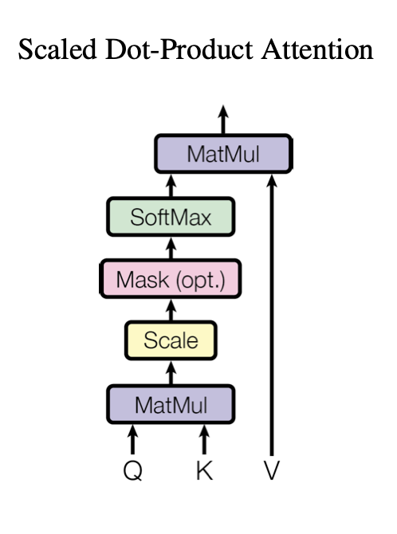
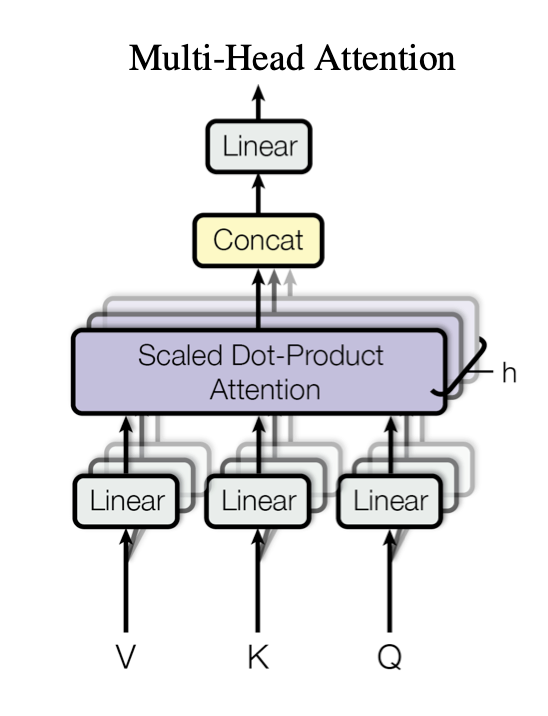
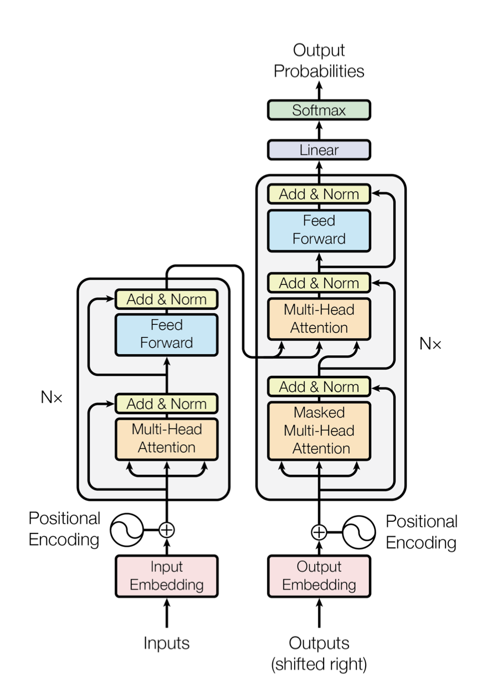

# Transformer model implementation TensorFlow Functional API

This document provides an overview of the Transformer model architecture, as described in the paper [Attention is All You Need](https://arxiv.org/abs/1706.03762) by Vaswani et al. The implementation discussed herein follows the principles outlined in the original paper and leverages the flexibility and power of the Transformer model for various sequence-to-sequence tasks.

## Table of contents

- [Overview](#overview)
- [Model architecture](#model-architecture)
  - [Scale Dot Product Attention](#scale-dot-product-attention)
  - [Multi-Head Attention](#multi-head-attention)
  - [Positional Encoding](#positional-encoding)
  - [Layer Normalisation](#layer-normalisation)
  - [Positionwise Feed Forward Network](#positionwise-feed-forward-network)
  - [Encoder Layer](#encoder-layer)
  - [Decoder Layer](#decoder-layer)
  - [Encoder](#encoder)
  - [Decoder](#decoder)
  - [Transformer](#transformer)
- [References](#references)

## Overview

The Transformer model introduced by Vaswani et al. represents a significant advancement in the field of Natural Language Processing (NLP). Unlike previous models, such as Recurrent Neural Networks (RNNs), the Transformer relies entirely on self-attention mechanisms, allowing it to process sequences in parallel and capture long-range dependencies more effectively. This model has been widely adopted for tasks like translation, summarisation, and language modeling.

## Model architecture

### Scale Dot Product Attention



The Scale Dot Product Attention is the core mechanism that enables the Transformer to focus on different parts of the input sequence when producing an output. The attention mechanism computes a weighted sum of the values `V`, where the weights are determined by the compatibility function between the query `Q` and the key `K`. The formula for attention is:

```python
def scaled_dot_product_attention(q, k, v, mask=None):
    matmul_qk = tf.matmul(q, k, transpose_b=True)
    dk = tf.cast(tf.shape(k)[-1], tf.float32)
    scaled_attention_logits = matmul_qk / tf.math.sqrt(dk)
    if mask is not None:
        scaled_attention_logits += (mask * -1e9)
    attention_weights = tf.nn.softmax(scaled_attention_logits, axis=-1)
    output = tf.matmul(attention_weights, v)
    return output, attention_weights
```

Attention(`Q`, `K`, `V`) = softmax((`QK`ᵀ) / √(dₖ)) `V`

Where:
- `Q` is the query matrix.
- `K` is the key matrix.
- `V` is the value matrix.
- `dₖ` is the dimension of the key vectors, used for scaling.

### Multi-Head Attention



Multi-Head Attention extends the attention mechanism by applying it multiple times with different learned linear projections. This allows the model to capture various aspects of the relationships between the sequences. The output of each attention head is concatenated and then linearly transformed:

```python
def multi_head_attention(d_model, num_heads):
    depth = d_model // num_heads

    def split_heads(x, batch_size):
        x = tf.reshape(x, (batch_size, -1, num_heads, depth))
        return tf.transpose(x, perm=[0, 2, 1, 3])

    q_input = Input(shape=(None, d_model))
    k_input = Input(shape=(None, d_model))
    v_input = Input(shape=(None, d_model))
    mask_input = Input(shape=(1, 1, None))

    batch_size = tf.shape(q_input)[0]

    q = Dense(d_model)(q_input)
    k = Dense(d_model)(k_input)
    v = Dense(d_model)(v_input)

    q = split_heads(q, batch_size)
    k = split_heads(k, batch_size)
    v = split_heads(v, batch_size)

    scaled_attention, attention_weights = scaled_dot_product_attention(q, k, v, mask_input)

    scaled_attention = tf.transpose(scaled_attention, perm=[0, 2, 1, 3])
    concat_attention = tf.reshape(scaled_attention, (batch_size, -1, d_model))

    output = Dense(d_model)(concat_attention)

    return Model(inputs=[q_input, k_input, v_input, mask_input], outputs=output)
```


MultiHead(`Q`, `K`, `V`) = Concat(head₁, ..., headₕ)Wᴼ

Where each head headᵢ is computed as:

headᵢ = Attention(`QW`ᵢᴼ, `KW`ᵢᴷ, `VW`ᵢⱽ)


And:
- `Wᵢᴼ`, `Wᵢᴷ`, and `Wᵢⱽ` are the learned projection matrices for the `i`-th head.
- `Wᴼ` is the output projection matrix.

### Positional Encoding

Since the Transformer model does not have any recurrence or convolution, it uses positional encoding to inject information about the relative or absolute position of the tokens in the sequence. The positional encoding is added to the input embeddings at the bottom of the encoder and decoder stacks:

```python
def positional_encoding(max_len, d_model):
    pos = tf.range(max_len, dtype=tf.float32)[:, tf.newaxis]
    _2i = tf.range(d_model, dtype=tf.float32)[tf.newaxis, :]
    angle_rads = pos / tf.pow(10000, (2 * (_2i // 2)) / tf.cast(d_model, tf.float32))

    sines = tf.sin(angle_rads[:, 0::2])
    cosines = tf.cos(angle_rads[:, 1::2])

    pos_encoding = tf.concat([sines, cosines], axis=-1)
    pos_encoding = pos_encoding[tf.newaxis, ...]

    return tf.cast(pos_encoding, dtype=tf.float32)
```


PE(`pos`, 2i) = sin(`pos` / 10000^(2i / d_model))

PE(`pos`, 2i+1) = cos(`pos` / 10000^(2i / d_model))

Where:
- `pos` is the position.
- `i` is the dimension.

### Layer Normalisation

Layer normalisation is used to stabilise and accelerate the training process by normalising the inputs across the features. The normalised output is computed as:

LayerNorm(x) = ((x - μ) / √(σ² + ε)) × γ + β


Where:
- `μ` and `σ²` are the mean and variance of the input `x`.
- `γ` and `β` are learnable parameters.
- `ε` is a small constant to avoid division by zero.

### Positionwise Feed Forward Network

Each position in the encoder and decoder is processed independently using a fully connected feed-forward network. This network consists of two linear transformations with a ReLU activation in between:

```python
def positionwise_feed_forward(d_model, dff, drop_rate=0.1):
    inputs = Input(shape=(None, d_model))
    x = Dense(dff, activation='relu')(inputs)
    x = Dropout(drop_rate)(x)
    outputs = Dense(d_model)(x)
    return Model(inputs=inputs, outputs=outputs)
```

FFN(x) = ReLU(xW₁ + b₁)W₂ + b₂

Where:
- `W₁` and `W₂` are weight matrices.
- `b₁` and `b₂` are bias vectors.

### Encoder Layer

The encoder layer is composed of two sub-layers: multi-head self-attention and positionwise feed-forward network, each followed by layer normalisation and residual connections:

```python
def encoder_layer(d_model, num_heads, dff, drop_rate=0.1):
    inputs = Input(shape=(None, d_model))
    mask_input = Input(shape=(1, 1, None))

    mha = multi_head_attention(d_model, num_heads)
    ffn = positionwise_feed_forward(d_model, dff, drop_rate)

    attn_output = mha([inputs, inputs, inputs, mask_input])
    attn_output = Dropout(drop_rate)(attn_output)
    out1 = LayerNormalization(epsilon=1e-6)(inputs + attn_output)

    ffn_output = ffn(out1)
    ffn_output = Dropout(drop_rate)(ffn_output)
    out2 = LayerNormalization(epsilon=1e-6)(out1 + ffn_output)

    return Model(inputs=[inputs, mask_input], outputs=out2)
```

EncoderLayer(x) = LayerNorm(x + MultiHead(`Q`, `K`, `V`))

EncoderLayer(x) = LayerNorm(x + FFN(x))

### Decoder Layer

The decoder layer includes an additional sub-layer for multi-head attention over the encoder’s output. The three sub-layers are:

```python
def decoder_layer(d_model, num_heads, dff, drop_rate=0.1):
    inputs = Input(shape=(None, d_model))
    enc_output = Input(shape=(None, d_model))
    look_ahead_mask = Input(shape=(1, 1, None))
    padding_mask = Input(shape=(1, 1, None))

    mha1 = multi_head_attention(d_model, num_heads)
    mha2 = multi_head_attention(d_model, num_heads)
    ffn = positionwise_feed_forward(d_model, dff, drop_rate)

    attn1 = mha1([inputs, inputs, inputs, look_ahead_mask])
    attn1 = Dropout(drop_rate)(attn1)
    out1 = LayerNormalization(epsilon=1e-6)(inputs + attn1)

    attn2 = mha2([out1, enc_output, enc_output, padding_mask])
    attn2 = Dropout(drop_rate)(attn2)
    out2 = LayerNormalization(epsilon=1e-6)(out1 + attn2)

    ffn_output = ffn(out2)
    ffn_output = Dropout(drop_rate)(ffn_output)
    out3 = LayerNormalization(epsilon=1e-6)(out2 + ffn_output)

    return Model(inputs=[inputs, enc_output, look_ahead_mask, padding_mask], outputs=out3)
```

1. Masked Multi-Head Self-Attention.
2. Multi-Head Attention over the encoder's output.
3. Positionwise Feed-Forward Network.

Each sub-layer is followed by layer normalisation and residual connections:

DecoderLayer(x) = LayerNorm(x + MaskedMultiHead(`Q`, `K`, `V`))

DecoderLayer(x) = LayerNorm(x + MultiHead(`Q`, `K`, `V`))

DecoderLayer(x) = LayerNorm(x + FFN(x))

### Encoder

The encoder is composed of multiple identical layers stacked together, each containing a multi-head self-attention mechanism and a positionwise feed-forward network. The output of the encoder is a sequence of continuous representations:

```python
def encoder(vocab_size, num_layers, d_model, num_heads, dff, max_len, drop_rate=0.1):
    inputs = Input(shape=(None,))
    mask_input = Input(shape=(1, 1, None))

    x = Embedding(vocab_size, d_model)(inputs)
    x *= tf.math.sqrt(tf.cast(d_model, tf.float32))
    x += get_positional_encoding(max_len, d_model)

    x = Dropout(drop_rate)(x)

    for _ in range(num_layers):
        enc_layer = encoder_layer(d_model, num_heads, dff, drop_rate)
        x = enc_layer([x, mask_input])

    return Model(inputs=[inputs, mask_input], outputs=x)
```

Encoder(x) = EncoderLayer_N(... EncoderLayer_2(EncoderLayer_1(x)) ...)

### Decoder

The decoder is similar to the encoder but includes an additional multi-head attention mechanism to attend to the encoder's output. The decoder generates an output sequence one step at a time:

```python
def decoder(vocab_size, num_layers, d_model, num_heads, dff, max_len, drop_rate=0.1):
    inputs = Input(shape=(None,))
    enc_output = Input(shape=(None, d_model))
    look_ahead_mask = Input(shape=(1, 1, None))
    padding_mask = Input(shape=(1, 1, None))

    x = Embedding(vocab_size, d_model)(inputs)
    x *= tf.math.sqrt(tf.cast(d_model, tf.float32))
    x += get_positional_encoding(max_len, d_model)

    x = Dropout(drop_rate)(x)

    for _ in range(num_layers):
        dec_layer = decoder_layer(d_model, num_heads, dff, drop_rate)
        x = dec_layer([x, enc_output, look_ahead_mask, padding_mask])

    outputs = Dense(vocab_size)(x)

    return Model(inputs=[inputs, enc_output, look_ahead_mask, padding_mask], outputs=outputs)
```

Decoder(y) = DecoderLayer_N(... DecoderLayer_2(DecoderLayer_1(y, EncoderOutput)) ...)

### Transformer

The Transformer model combines the encoder and decoder into a single end-to-end model that can be trained on sequence-to-sequence tasks:

```python
def transformer(num_layers, d_model, num_heads, dff, input_vocab_size, target_vocab_size, pe_input, pe_target,
                drop_rate=0.1):
    inputs = Input(shape=(None,))
    targets = Input(shape=(None,))

    enc_padding_mask = Input(shape=(1, 1, None))
    look_ahead_mask = Input(shape=(1, 1, None))
    dec_padding_mask = Input(shape=(1, 1, None))

    enc_output = encoder(input_vocab_size, num_layers, d_model, num_heads, dff, pe_input, drop_rate)(
        [inputs, enc_padding_mask])

    dec_output = decoder(target_vocab_size, num_layers, d_model, num_heads, dff, pe_target, drop_rate)(
        [targets, enc_output, look_ahead_mask, dec_padding_mask])

    final_output = Dense(target_vocab_size)(dec_output)

    return Model(inputs=[inputs, targets, enc_padding_mask, look_ahead_mask, dec_padding_mask], outputs=final_output)
```

Transformer(x, y) = Decoder(Encoder(x), y)



## References

- Vaswani, A., Shazeer, N., Parmar, N., Uszkoreit, J., Jones, L., Gomez, A. N., ... & Polosukhin, I. (2017). Attention is all you need. In Advances in neural information processing systems (pp. 5998-6008).
- [TensorFlow Documentation](https://www.tensorflow.org/api_docs/python/tf)
